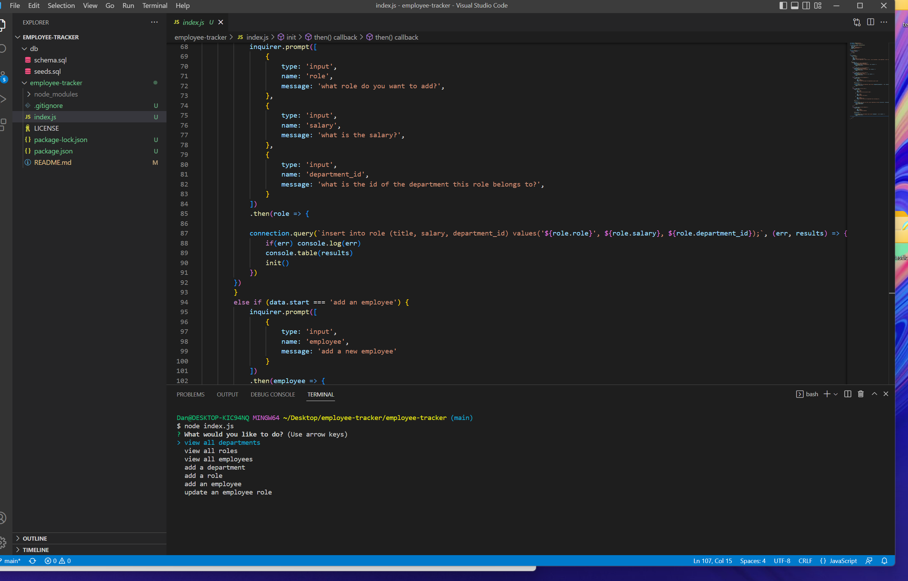
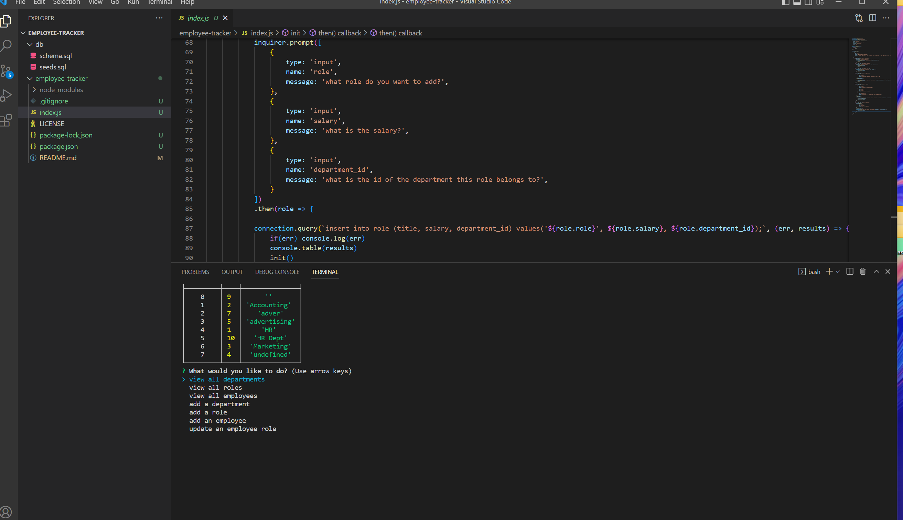
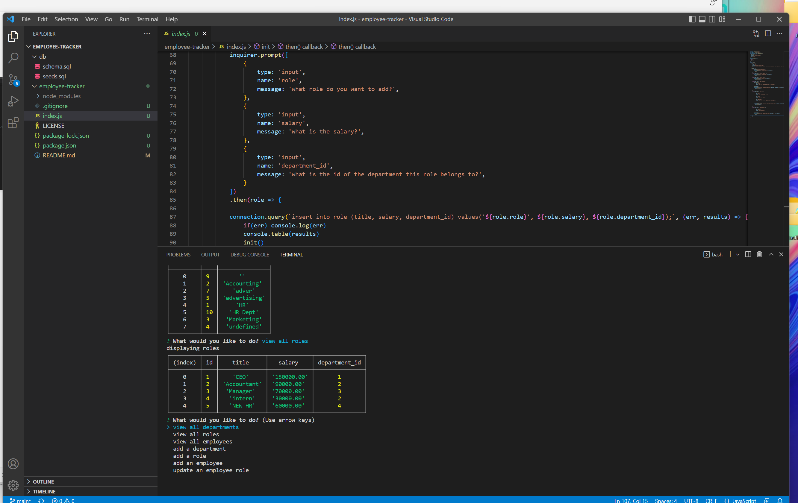
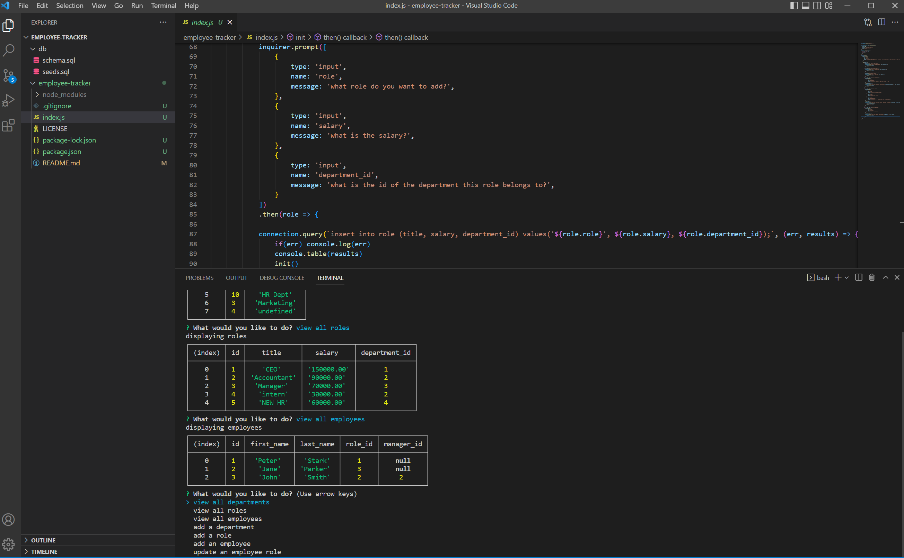
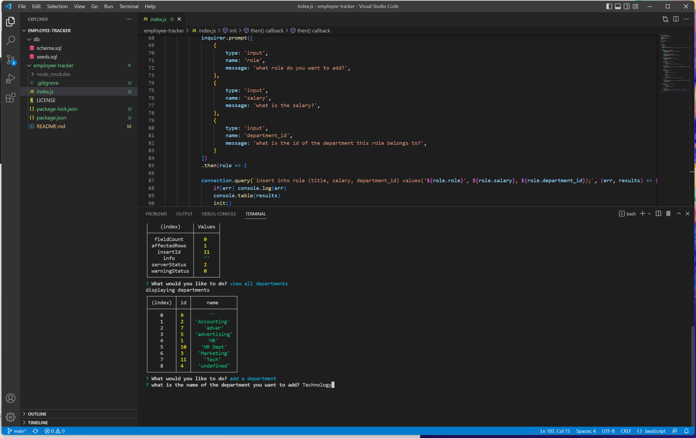
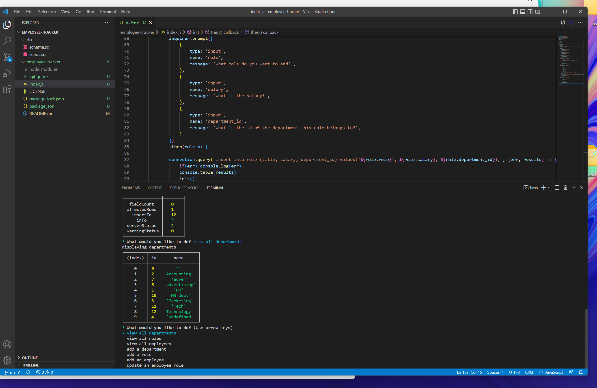
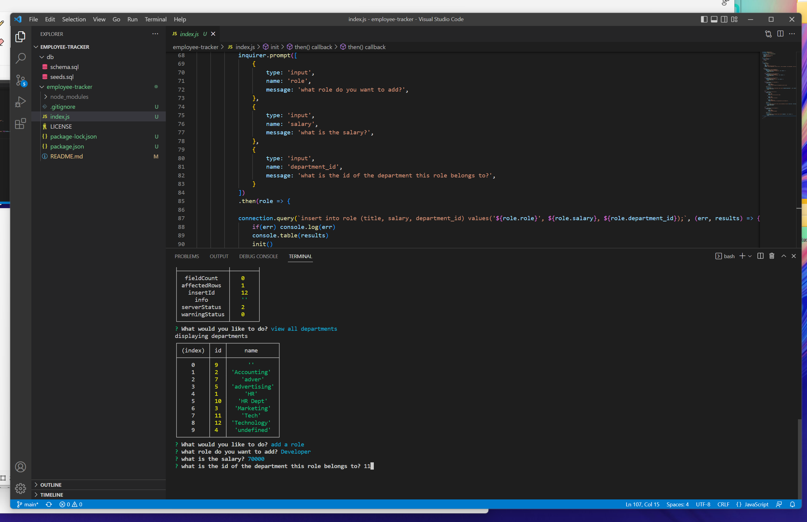
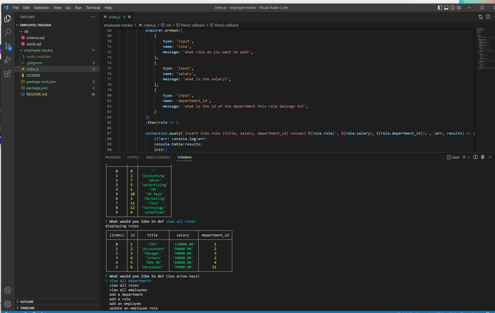

# employee-tracker

[![Contributors][contributors-shield]][contributors-url]
[![Forks][forks-shield]][forks-url]
[![Stargazers][stars-shield]][stars-url]
[![Issues][issues-shield]][issues-url]
[![MIT License][license-shield]][license-url]

<!-- PROJECT LOGO -->
 

    

  <h3 align="center">Employee Tracker README</h3>

  

    Welcome to the Employee Tracker README, a great spot to get to know this project!
     
    <a href="https://github.com/danpoggetti/employee-tracker"><strong>Explore the docs »</strong></a>
     
     
    <a href="https://danpoggetti.github.io/employee-tracker/">View Demo</a>
    ·
    <a href="https://github.com/danpoggetti/employee-tracker/issues">Report Bug</a>
    ·
    <a href="https://github.com/danpoggetti/employee-tracker/issues">Request Feature</a>
  

<!-- TABLE OF CONTENTS -->

  
Table of Contents

  <ol>
    <li>
      <a href="#about-the-project">About The Project</a>
      <ul>
        <li><a href="#built-with">Built With</a></li>
      </ul>
    </li>
    <li><a href="#getting-started">Getting Started</a></li>
    <li><a href="#usage">Usage</a></li>
    <li><a href="#roadmap">Roadmap</a></li>
    <li><a href="#contributing">Contributing</a></li>
    <li><a href="#license">License</a></li>
    <li><a href="#contact">Contact</a></li>
    <li><a href="#acknowledgments">Acknowledgments</a></li>
  </ol>

<!-- ABOUT THE PROJECT -->
## About The Project

I was tasked to create a employee tracker app so that a business owner can:
Can view and manage the departments, roles, and employees in my company
SO THAT I can organize and plan my business

GIVEN a command-line application that accepts user input
WHEN I start the application
THEN I am presented with the following options: view all departments, view all roles, view all employees, add a department, add a role, add an employee, and update an employee role
WHEN I choose to view all departments
THEN I am presented with a formatted table showing department names and department ids
WHEN I choose to view all roles
THEN I am presented with the job title, role id, the department that role belongs to, and the salary for that role
WHEN I choose to view all employees
THEN I am presented with a formatted table showing employee data, including employee ids, first names, last names, job titles, departments, salaries, and managers that the employees report to
WHEN I choose to add a department
THEN I am prompted to enter the name of the department and that department is added to the database
WHEN I choose to add a role
THEN I am prompted to enter the name, salary, and department for the role and that role is added to the database
WHEN I choose to add an employee
THEN I am prompted to enter the employee’s first name, last name, role, and manager, and that employee is added to the database
WHEN I choose to update an employee role
THEN I am prompted to select an employee to update and their new role and this information is updated in the database

(<a href="#readme-top">back to top</a>)

### Built With

Below are the following technologies and applications utilized to help build the project. 

VS Code 
JavaScript 
Node 
MySQL2 
Inquirer 

(<a href="#readme-top">back to top</a>)

<!-- GETTING STARTED -->
## Getting Started

Below you'll be able to see screen shots of the deployed app. You can also view the road map to see how you can test it locally.

(<a href="#readme-top">back to top</a>)

<!-- USAGE EXAMPLES -->
## Usage

Here's a video tutorial on how to use the app: 
<a href="https://drive.google.com/file/d/1Zq4aYkLg1-JVaUh16yWv3aDe4WyT0rsf/view">View Tutorial</a>  

Here's a screen shot of what the app looks like when someone starts it.

(<a href="#readme-top">back to top</a>)

<!-- ROADMAP -->
## Roadmap

- [ ] Start the application
- [ ] Choose to view all departments and a formatted table showing department names and ids triggers
- [ ] If view roles is selected, a user will be able to view job title, role id and the department tha tthe role belings to
- [ ] Can instead select view all employees and user is presented with:
    - [ ] Employee data
    - [ ] Employee ID
    - [ ] Salary
- [ ] A user can add a role with department id and salary
- [ ] A user can view all departments with updated changes

See the [open issues](https://github.com/danpoggetti/employee-tracker/issues) for a full list of proposed features (and known issues).

(<a href="#readme-top">back to top</a>)

<!-- CONTRIBUTING -->
## Contributing

I strongly feel that contributing well throught and engaging suggestions are instrumental. I am an avid learner and want to let you know any contribution or suggestions are apprecaited.

If you truly believe you can contribute to making this website better, please fork the repo and create a pull request. If you do not wish to fork, you can open and create an issue with the tag "enhancement" or "suggestions". I will then be able to review it and take it into consideration. Lastly, please don't forget to give the project a star!

1. Fork the Project
2. Create your Feature Branch (`git checkout -b feature/newSuggestion`)
3. Commit your Changes (`git commit -m 'Add some NewSuggestion'`)
4. Push to the Branch (`git push origin feature/NewSuggestion`)
5. Open a Pull Request

(<a href="#readme-top">back to top</a>)

<!-- LICENSE -->
## License

Distributed under the MIT License. 
Copyright (c) 2022 Dan Poggetti 
See License.text for more information.

(<a href="#readme-top">back to top</a>)

<!-- CONTACT -->
## Contact

Dan Poggetti - GitHub [https://github.com/danpoggetti]

Project Link: [https://github.com/danpoggetti/employee-tracker]

Demo Link: [https://danpoggetti.github.io/employee-tracker/]

(<a href="#readme-top">back to top</a>)

<!-- ACKNOWLEDGMENTS -->
## Acknowledgments

I want to acknowledge the many great and vast resouces that adided us in creating this weather dashboard app.

* [Google](https://www.google.com)
* [YouTube](https://www.youtube.com)
* [GitHub Pages](https://pages.github.com)
* Jacob Carber
* [README Template courtesy of othneildrew](https://github.com/othneildrew/Best-README-Template)
* [MIT License text](https://mit-license.org/license.txt)
* [Shields.io for badges](https://shields.io/)

(<a href="#readme-top">back to top</a>)

<!-- MARKDOWN LINKS & IMAGES -->
<!-- https://www.markdownguide.org/basic-syntax/#reference-style-links -->
[contributors-shield]: https://img.shields.io/github/contributors-anon/danpoggetti/employee-tracker?style=for-the-badge
[contributors-url]: https://github.com/danpoggetti/employee-tracker/graphs/contributors
[forks-shield]: https://img.shields.io/github/forks/danpoggetti/employee-tracker?style=for-the-badge
[forks-url]: https://github.com/danpoggetti/employee-tracker/network/members
[stars-shield]: https://img.shields.io/github/stars/danpoggetti/employee-tracker?style=for-the-badge
[stars-url]: https://github.com/danpoggetti/employee-tracker/stargazers
[issues-shield]: https://img.shields.io/github/issues/danpoggetti/employee-tracker?style=for-the-badge
[issues-url]: https://github.com/danpoggetti/employee-tracker/issues
[license-shield]: https://img.shields.io/github/license/danpoggetti/employee-tracker?style=for-the-badge
[license-url]: https://github.com/danpoggetti/employee-tracker/blob/main/LICENSE
[product-screenshot]: images/screenshot.png
